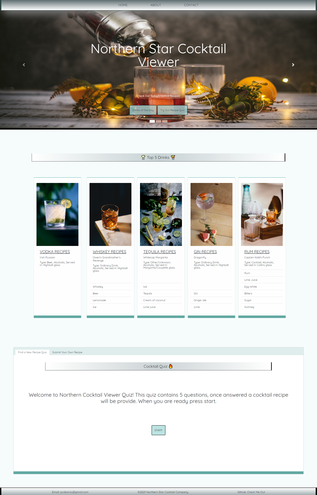

# Northern Cocktail Viewer 

    
    

    
    
        
    
    
    

## Overview
Giving information to the user about new alcoholic beverages to try as well as pull from API 
and interpret data for drink recipes. 
Taking that and organizing the data so the users can come to our website and learn more about mixology. 
As well as get users to look at the adds for revenue theoretically.

## Table of Contents
- [Overview](#overview)
- [Authors](#authors)
- [Preview](#preview)
- [Features](#features)
- [Demo](#linktodeployedpage)
- [Preview](#preview)
- [Repo](#linktodeployedrepo)

## Authors
- [Sophia](https://github.com/soph-k)
- [Benny](https://github.com/Malletmania)
- [Bentura Peralez](https://github.com/BenturaPeralez)
- [Andrew Trudeau](https://github.com/andrewtrudeau)
- Version 1.1

## Features
- HTML 
- CSS
    -  Bootstrap
    - Animate.css
- Javascript 
    - jQuery

## Link to Deployed Page
[Live Demo](https://soph-k.github.io/northern_cocktail_viewer/)

## Preview

    
## Link to Deployed Repo
[Repo](https://github.com/soph-k/northern_cocktail_viewer)

## Contribution
Contributions are accepted. Feel free to fork without permission.

## License
This project is under the MIT license.

### Questions
For questions about this project, please review the GitHub repo at [soph-k](https://github.com/soph-k/northern_cocktail_viewer) or contact on of the contributors directly on Github.
 

### Bugs
There are currently no known bugs within this file.
